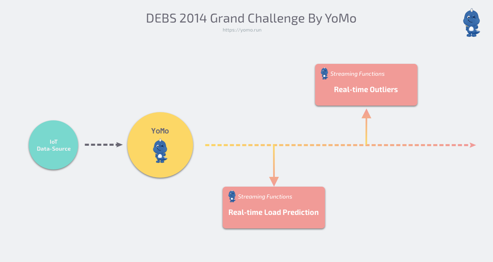

# DEBS 2014 Grand Challenge - YoMo Implementation

This repository accompanies our blog post "[DEBS Grand Challenge: Real-Time Stream Processing with YoMo](https://blog.yomo.run/posts/debs2014-grand-challenge-by-yomo)."

## Introduction

[DEBS](https://dl.acm.org/conference/debs) or the **ACM International Conference on Distributed Event Based Systems** aims to "provide a forum dedicated to the dissemination of original research, the discussion of practical insights, and the reporting of experiences relevant to event based computing that were previously scattered across several scientific and professional communities" ([reference](http://www.wikicfp.com/cfp/servlet/event.showcfp?eventid=34432)).

[The DEBS 2014 Grand Challenge - Smart Grid](https://debs.org/grand-challenges/2014/) is the 8th ACM International Conference on Distributed Event Based Systems. It focused on two problems which are relevant to the industry: real-time load prediction and anomaly detection. The data for the challenge was collected from a number of smart-home installations deployed in Germany.

## System Architecture

With [YoMo](https://github.com/yomorun/yomo), we can build a real-time stream processing system like the following:



## Getting Started

1. Install `yomo` CLI: `go get -u github.com/yomorun/yomo/cmd/yomo && yomo --version`.
2. Clone this repository by typing `git clone git@github.com:yomorun/debs-2014.git`. 
3. Download the [data file](http://www.doc.ic.ac.uk/~mweidlic/sorted.csv.gz) and put it in `debs-source`.
    ```
    .
    ├── README.md
    ├── debs-flow
    │   ├── app.go
    │   ├── go.mod
    │   ├── go.sum
    │   └── sl.so
    ├── debs-source
    │   ├── data.csv
    │   ├── go.mod
    │   ├── go.sum
    │   └── main.go
    └── debs-zipper
        └── workflow.yaml
    ```
4. Start `debs-zipper`: `yomo wf run debs-zipper/workflow.yaml`.
5. Start `debs-flow`: open a new terminal window and run `cd debs-flow && go run app.go`.
6. Start `debs-source` to generate IoT data: open a 3rd terminal window and run `cd debs-source && go run main.go`.

You should be able to see some exciting results! :)

### Join Our Community

- [yomorun/yomo](https://github.com/yomorun/yomo)
- [Discord](https://discord.gg/ccuttFYC)
